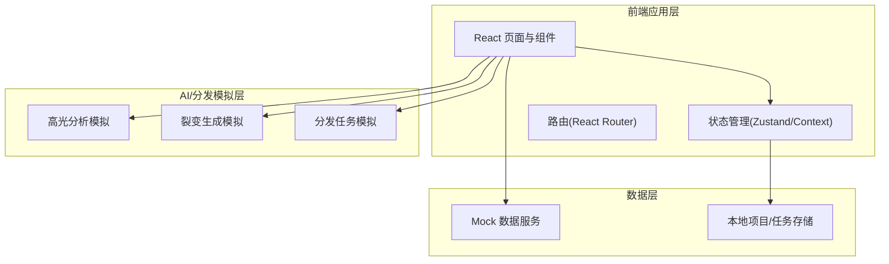
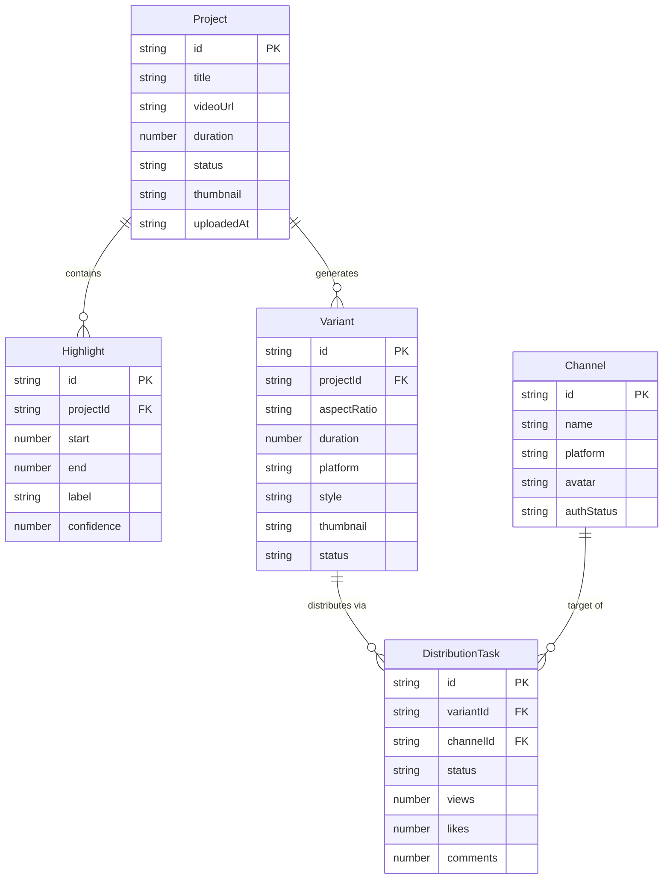

## 1. 架构设计

纯前端单页应用，使用 Mock 数据模拟 AI 分析、裂变生成与分发流程，所有状态由客户端管理。



## 2. 技术描述
- **前端框架**：React@18 + Vite + TypeScript
- **样式方案**：TailwindCSS@3 + CSS 变量主题
- **动画库**：Motion（framer-motion）用于页面载入与微交互
- **图标库**：lucide-react
- **路由**：React Router@6
- **状态管理**：Zustand（轻量、适合本项目规模）
- **初始化工具**：vite-init（react-ts 模板）
- **后端**：无（纯前端，Mock 数据模拟全部业务流程）
- **数据库**：无（内存 + localStorage 持久化项目状态）

## 3. 路由定义
| 路由 | 用途 |
|------|------|
| `/` | 工作台首页：数据看板 + 最近项目 + 快捷上传 |
| `/upload` | 上传与项目库：拖拽上传 + 项目列表 |
| `/studio/:projectId` | 高光剪辑工作台：视频预览 + 高光时间轴 + 片段选择 |
| `/fission/:projectId` | 裂变中心：维度配置 + 变体矩阵 |
| `/distribute` | 分发中心：渠道选择 + 任务队列 + 数据回收 |
| `/channels` | 渠道管理：已连接渠道列表 + 授权 |

## 4. 数据模型

### 4.1 核心数据模型定义



### 4.2 关键数据结构（TypeScript）

```typescript
// 项目
interface Project {
  id: string;
  title: string;
  videoUrl: string;
  duration: number;        // 秒
  status: 'analyzing' | 'ready' | 'clipped' | 'fissioned' | 'distributed';
  thumbnail: string;
  uploadedAt: string;
  highlights: Highlight[];
  variants: Variant[];
}

// 高光片段
interface Highlight {
  id: string;
  projectId: string;
  start: number;           // 起始秒
  end: number;             // 结束秒
  label: string;           // 如"精彩反转""高潮金句"
  confidence: number;      // 0-1 置信度
  type: 'peak' | 'quote' | 'action' | 'emotion';
}

// 裂变变体
interface Variant {
  id: string;
  projectId: string;
  aspectRatio: '9:16' | '1:1' | '16:9' | '4:5';
  duration: 15 | 30 | 60;
  platform: string;
  style: string;
  thumbnail: string;
  status: 'generating' | 'ready' | 'failed';
}

// 渠道
interface Channel {
  id: string;
  name: string;
  platform: 'douyin' | 'xiaohongshu' | 'wechat' | 'bilibili' | 'youtube';
  avatar: string;
  authStatus: 'connected' | 'expired' | 'disconnected';
  followers: number;
}

// 分发任务
interface DistributionTask {
  id: string;
  variantId: string;
  channelId: string;
  status: 'queued' | 'publishing' | 'published' | 'failed';
  publishedAt?: string;
  stats?: { views: number; likes: number; comments: number; shares: number };
}
```

## 5. Mock 数据策略
- 内置 3-5 个示例项目，覆盖不同状态（分析中/已剪辑/已裂变/已分发）
- 每个项目预置 6-10 个高光片段，带置信度与类型标签
- 内置 5 个渠道账号（抖音/小红书/视频号/B站/YouTube）
- AI 分析、裂变生成、分发均用 setTimeout 模拟异步进度，前端展示真实进度条与状态流转
- 使用 localStorage 持久化用户操作产生的项目与任务变更

## 6. 项目结构

```
src/
├── main.tsx
├── App.tsx
├── index.css
├── components/
│   ├── layout/          # Sidebar, TopBar
│   ├── ui/              # Button, Card, Badge, ProgressRing
│   └── shared/          # VideoPreviewer, Timeline, VariantGrid
├── pages/
│   ├── Dashboard.tsx
│   ├── Upload.tsx
│   ├── Studio.tsx
│   ├── Fission.tsx
│   ├── Distribute.tsx
│   └── Channels.tsx
├── store/
│   └── useProjectStore.ts
├── data/
│   └── mock.ts
└── lib/
    └── utils.ts
```
